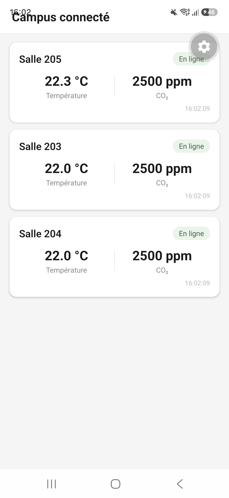

# J1 - Du capteur au téléphone

## Situation

Le responsable du campus veut voir la température et le CO2 d'une salle.

## Questions à résoudre

- **Qui produit la mesure, qui la transporte, qui la conserve et qui l'affiche ?**

  C'est l'objet connecté donc le capteur qui relève la mesure. Elle est transportée par le broker MQTT. Ensuite c'est mon backend qui récupère les données transmises par le broker MQTT, qui les stocke en base de données. Enfin, c'est l'application mobile qui affiche les données en interrogant le backend.

- **Pourquoi une API et un broker ont-ils des rôles différents ?**

  Le broker MQTT a comme rôle principal de diffuser des flux de données à l'ensemble des services qui se sont abonnés. Il ne conserve aucun historique.
  Tandis que l'API, transmet les données seulement quand elle reçoit les demandes du client et fait le lien avec la BDD.

- **Qu'affiche le téléphone pendant le chargement ou si aucune mesure n'existe ?**

  L'application mobile doit afficher un écran de chargement (un texte et un icône de chargement) ou bien un état vide explicite si aucune mesure n'existe, ainsi qu'un message d'erreur si l'API ne répond pas.

---

## Jalon de fin de journée

- **Une variation du simulateur atteint le téléphone en passant par le backend.**

  Le simulateur envoie des données que l'on voit tout d'abord grâce aux logs du backend (`docker compose logs backend`), on peut vérifier les données dans l'API. Ensuite on peut voir que les données sont sur l'application.
  

- **L’équipe peut retrouver le même objet à chaque étape.**

  Les identifiants des salles sont traçables à toutes les étapes. Par exemple 'sensor-001' est présent dans les logs backend, le PostgreSQL, l'API et sur l'interface mobile.

- **Le mobile gère le chargement et une erreur d’API.**

  Il y a plusieurs états, comme l'état de chargement qui affiche un texte et une icône de chargement, et un état erreur qui s'affiche lorsque la connexion avec le backend ne s'effectue plus.

- **Chaque membre explique le trajet de la donnée.**

  Charlotte : Le capteur produit et publie les valeurs via MQTT. Ensuite le broket MQTT transmet au backend, qui lui enregitre les données en BDD. L'API reçoit la requette de l'application et lit la donnée de la BDD. Enfin l'application reçoit la valaur de l'API et l'affiche

  Iana : Le capteur mesure la température et le CO₂, puis publie ces données via MQTT. Le broker MQTT les transmet ensuite au backend, qui les enregistre dans la base de données. Lorsque l’application mobile envoie une requête à l’API, celle-ci récupère les données dans la base de données et les lui renvoie. Enfin, l’application mobile reçoit les valeurs et les affiche à l’écran.

---

## Contributions

- **Charlotte :** Création et configuration du dépôt GitHub, intégration des schémas de la chaîne de données, conception de l'Application

- **Iana :** Création du backend Node.js avec la connexion MQTT, conception de la base de données et développement des routes de l'API REST
