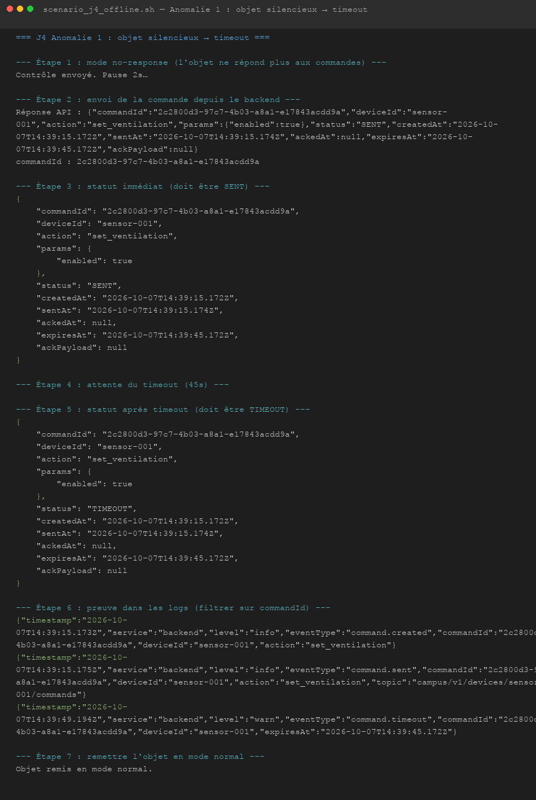
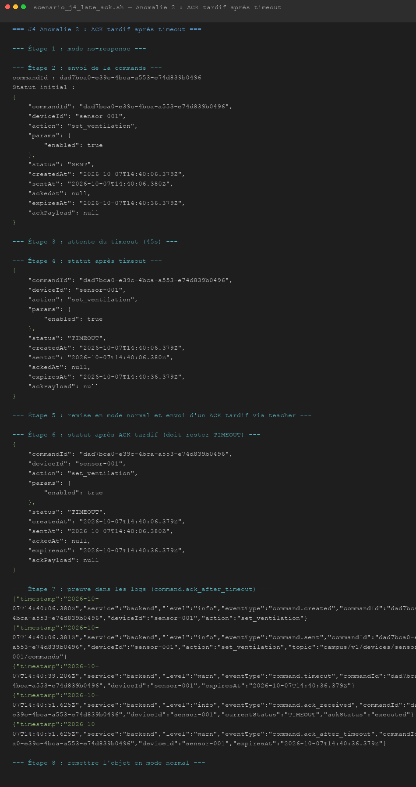
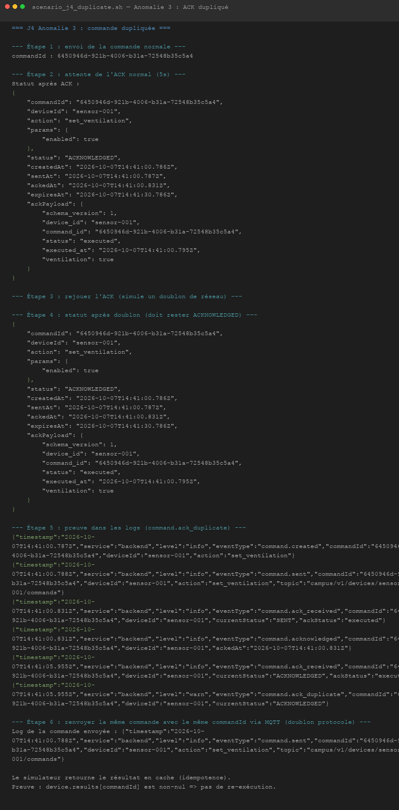

# J4 — Commander un objet et confirmer l'exécution

## Situation

Depuis son téléphone, un utilisateur demande l'activation de la ventilation. Le système doit distinguer la demande envoyée de l'action réellement exécutée par l'objet.

---

## Questions à résoudre

- **Quelle différence entre une commande acceptée par le backend, publiée sur MQTT, reçue par l'objet et réellement exécutée ?**

  Ce sont quatre étapes distinctes. Quand le backend accepte une commande, il sait seulement qu'elle est valide et qu'il l'a enregistrée. Quand il la publie sur MQTT, il sait que le broker l'a reçue, mais il ne sait pas encore si l'objet est là pour la lire. Quand l'objet la reçoit, il peut encore choisir de la rejeter si elle est expirée ou mal formée. La seule étape certaine est l'exécution réelle : le système ne peut l'affirmer qu'après avoir reçu un ACK de l'objet avec le statut `executed`.

- **Comment rattacher la réponse de l'objet à la bonne commande ?**

  À chaque nouvelle commande, le backend génère un identifiant unique (`commandId`). Cet identifiant est inclus dans le message MQTT envoyé à l'objet. L'objet recopie ce même `commandId` dans sa réponse. Quand le backend reçoit la réponse, il cherche en base la commande qui porte cet identifiant et met son statut à jour. Si le `commandId` est inconnu, la réponse est ignorée.

- **Que doit faire le système si l'objet est hors ligne, si l'ACK est perdu ou s'il arrive après le timeout ?**

  Si l'objet est hors ligne ou ne répond pas, aucun ACK n'arrive. Le backend vérifie toutes les 10 secondes si des commandes ont dépassé leur date d'expiration (`expires_at`). Quand c'est le cas, il les passe en `TIMEOUT` et produit un log. Si un ACK arrive après ce timeout, le backend le logge comme `command.ack_after_timeout` mais ne change pas l'état : la commande reste `TIMEOUT` parce que le système ne peut plus savoir si l'objet a bien exécuté l'action au bon moment.

- **Que se passe-t-il si la même commande est reçue deux fois ?**

  Le simulateur stocke en mémoire le résultat de chaque `commandId` déjà traité. Si la même commande arrive une deuxième fois, il retourne le résultat précédent sans ré-exécuter l'action : la ventilation ne change pas une deuxième fois. Côté backend, si un ACK arrive pour une commande déjà terminée (`ACKNOWLEDGED` ou `FAILED`), il produit un log `command.ack_duplicate` et ignore la réponse. Le statut en base ne change pas.

---

## Jalons de fin de journée

- **Une commande initiée depuis le téléphone atteint l'objet via le backend et MQTT.**

  L'utilisateur appuie sur le bouton « Activer » dans l'application. L'application envoie un `POST /api/rooms/{roomId}/commands` au backend. Le backend crée la commande en base (`PENDING`), la publie sur `campus/v1/devices/{deviceId}/commands` en QoS 1 (`SENT`), et retourne le `commandId` à l'application. On peut suivre ce parcours dans les logs avec le `commandId`.

- **L'objet renvoie un ACK contenant le `commandId` et le backend rattache ce retour à la bonne commande.**

  Le simulateur reçoit la commande, appelle `device.execute()`, et publie un ACK sur `campus/v1/devices/{deviceId}/results` avec le même `commandId` et le statut `executed`. Le backend reçoit cet ACK, retrouve la commande par son identifiant et la passe en `ACKNOWLEDGED`.

- **Le mobile distingue clairement une commande en attente, confirmée, échouée ou expirée.**

  L'application interroge `GET /api/commands/{commandId}` toutes les 2 secondes après avoir envoyé une commande. Pendant l'attente, un spinner s'affiche. Une fois l'ACK reçu, l'état passe au vert « Confirmée ». En cas de rejet, il passe au rouge « Rejetée ». En cas de timeout, il affiche en gris « Expirée (pas de réponse) ».

- **Une absence d'ACK déclenche un timeout reproductible.**

  On met l'objet en mode silencieux via `campus/v1/simulator/{deviceId}/control` avec l'action `no-response`. On envoie une commande. Après 30 secondes, le backend passe la commande en `TIMEOUT` et logge `command.timeout`. Le script `scenario/tests/scenario_j4_offline.sh` reproduit ce comportement et vérifie le statut via l'API.

- **À partir d'un `commandId`, les logs permettent de reconstruire le parcours réel.**

  En filtrant les logs sur `commandId` :

  ```
  docker logs applicationmobileiot-backend-1 2>&1 | grep "<commandId>"
  ```

  On obtient la séquence complète : `command.created` → `command.sent` → `command.ack_received` → `command.acknowledged` (ou `command.timeout`). Chaque étape porte son horodatage.

- **Une commande rejouée ne provoque pas silencieusement une double exécution.**

  Le `commandId` est la clé d'idempotence. L'objet ne re-exécute jamais une action pour un `commandId` déjà traité. Le backend ignore les ACK dupliqués. Le script `scenario/tests/scenario_j4_duplicate.sh` en apporte la preuve.

- **L'équipe peut expliquer ce que le système sait réellement à chaque étape.**

  Voir les réponses aux questions ci-dessus. En résumé : le système n'affirme l'exécution qu'après réception de l'ACK. Avant ça, il déclare l'incertitude (`SENT`, `TIMEOUT`) plutôt que de la masquer.

---

## Anomalies simulées

**Anomalie 1 — Objet silencieux** (`scenario_j4_offline.sh`)  
L'objet est mis en mode `no-response`. La commande passe en `TIMEOUT` après 30 secondes. Log visible : `command.timeout`.

**Anomalie 2 — ACK tardif** (`scenario_j4_late_ack.sh`)  
L'objet est mis en mode silencieux, la commande arrive en `TIMEOUT`, puis on rejoue un ACK manuellement via `teacher`. Le statut reste `TIMEOUT`. Log visible : `command.ack_after_timeout`.

**Anomalie 3 — Commande dupliquée** (`scenario_j4_duplicate.sh`)  
Une commande est exécutée normalement puis son ACK est rejoué manuellement. Le statut reste `ACKNOWLEDGED`. Log visible : `command.ack_duplicate`.

---

## Contributions

- **Charlotte :** Développement des routes HTTP de commande, interface mobile (section ventilation, états PENDING / ACKNOWLEDGED / FAILED / TIMEOUT), documentation J4 et scénarios d'anomalies.

- **Iana :** Conception du `CommandService` (cycle de vie, timeout, idempotence), migration PostgreSQL et `PgCommandRepository`, câblage MQTT (subscribe `results`, publish `commands`), ADR-004.

## 

## 

## 
