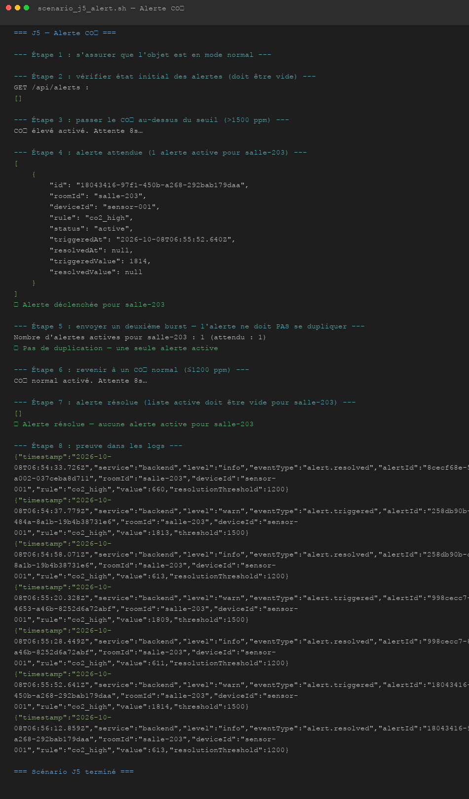
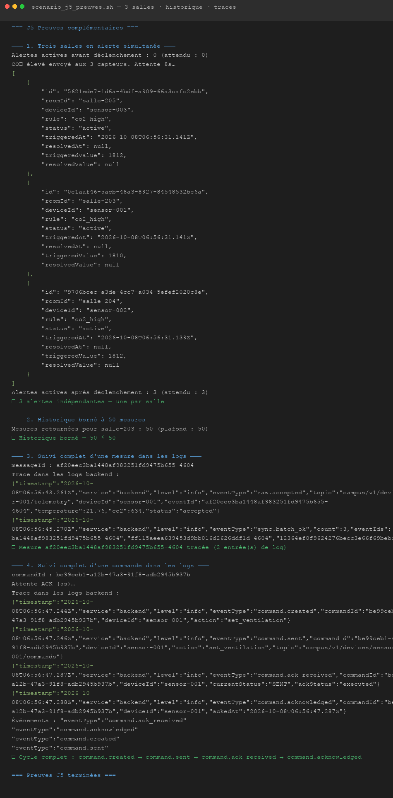

# J5 — Rendre le produit exploitable

## Situation

Plusieurs salles émettent des mesures et une règle doit signaler une anomalie.

## Questions à résoudre

- **Faut-il conserver et afficher toutes les mesures ?**

  Il faut conserver toutes les mesures, mais pas toutes les afficher. Nous stockons chaque mesure acceptée dans PostgreSQL sans suppression automatique, ce qui permet de garder un historique complet pour un audit éventuel. En revanche, l'API borne les lectures à 50 mesures par salle (`HISTORY_LIMIT = 50`). Afficher des centaines de lignes brutes sur un téléphone n'apporte pas de valeur supplémentaire : la tendance et la moyenne sur les 50 dernières valeurs suffisent pour évaluer l'état d'une salle. La borne est uniquement à la lecture — les données complètes restent accessibles via une requête SQL directe.

- **Comment éviter de créer une nouvelle alerte à chaque message ?**

  On conserve l'état de l'alerte en base de données. Quand une mesure de CO₂ dépasse 1 500 ppm, le backend vérifie d'abord s'il existe déjà une alerte active pour cette salle. Si oui, il ne fait rien. Si non, il en crée une seule et logue `alert.triggered`. L'alerte reste active jusqu'à ce que le CO₂ repasse sous 1 200 ppm : à ce moment-là, elle est marquée résolue et le log `alert.resolved` est émis. L'écart de 300 ppm entre le seuil de déclenchement et le seuil de résolution évite les oscillations quand le CO₂ flotte autour de la limite. Ainsi, qu'il y ait 1 ou 100 mesures consécutives à CO₂ élevé, la table `alerts` ne contient qu'une seule ligne active par salle.

- **Comment identifier le composant en cause quand l'écran ne se met plus à jour ?**

  Si l'API ne répond plus, `GET /api/health` l'indique immédiatement avec le champ `dependencies` qui distingue postgres, mongo, redis et mqtt. Si l'API répond mais que les données sont figées, on cherche dans les logs si le backend reçoit encore des mesures : `docker compose logs backend | grep "raw.accepted"`. Si ces logs sont absents, le problème est en amont — on vérifie le simulateur (`docker compose logs simulator`), puis le broker (champ `dependencies.mqtt` dans le health). Si le backend reçoit bien mais que PostgreSQL est en retard, le champ `sync.status` du health passe à `blocked`. À chaque étape, les logs structurés contiennent le `messageId` ou le `commandId` concerné, ce qui permet de reconstituer le parcours complet d'un message dans les logs sans avoir à rien changer au code.

---

## Jalons de fin de journée

- **Le parcours complet est utilisable et les incidents principaux sont testés.**

  Les trois salles (salle-203, salle-204, salle-205) reçoivent des mesures en continu depuis le simulateur. La liste des salles se rafraîchit toutes les 5 secondes. La commande de ventilation fonctionne avec suivi du statut jusqu'à confirmation. Les scénarios testés couvrent la pause capteur, le doublon, le payload invalide, le timeout de commande et l'alerte CO₂.

- **Les alertes ne se multiplient pas à chaque mesure.**

  `AlertService.evaluate()` est appelé après chaque mesure acceptée. Il interroge la table `alerts` pour vérifier si une alerte `co2_high` est déjà active pour la salle. Sur un flux de 30 mesures consécutives à CO₂ élevé, une seule ligne `active` existe en base et un seul log `alert.triggered` a été émis.

  Preuve reproductible :

  ```sh
  ROOM=salle-203 DEVICE=sensor-001 bash scenario/tests/scenario_j5_alert.sh
  # ✓ Alerte déclenchée pour salle-203
  # ✓ Pas de duplication — une seule alerte active
  # ✓ Alerte résolue — aucune alerte active pour salle-203
  ```

- **Une mesure et une commande peuvent être suivies dans les traces.**

  Pour une mesure, il suffit de récupérer son `messageId` via l'API et de filtrer les logs dessus :

  ```sh
  MSG=$(curl -s http://localhost:3000/api/rooms/salle-203/history | python3 -c "import sys,json; print(json.load(sys.stdin)[0]['messageId'])")
  docker compose logs backend 2>&1 | grep "$MSG"
  # → raw.accepted ... sync.batch_ok
  ```

  Pour une commande, on filtre sur le `commandId` retourné lors de l'envoi :

  ```sh
  CMD=$(curl -s -X POST http://localhost:3000/api/rooms/salle-203/commands \
    -H "Content-Type: application/json" -d '{"action":"set_ventilation","enabled":true}')
  ID=$(echo "$CMD" | python3 -c "import sys,json; print(json.load(sys.stdin)['commandId'])")
  docker compose logs backend 2>&1 | grep "$ID"
  # → command.created → command.sent → command.ack_received → command.acknowledged
  ```

- **Le code, les consignes de lancement et les limites connues sont à jour.**

  Le `README.md` décrit le lancement complet en moins de cinq commandes et inclut la nouvelle section alertes. Le fichier `docs/architecture.md` a été mis à jour avec le flux J5 et la table `alerts`. Les limites connues sont listées ci-dessous.

---

## Limites connues

- Les seuils d'alerte (1 500 ppm / 1 200 ppm) sont des variables d'environnement (`CO2_ALERT_THRESHOLD`, `CO2_ALERT_RESOLUTION`). Les modifier nécessite un redémarrage du backend.
- Seules les alertes actives sont affichées dans l'application. L'historique des alertes résolues est conservé en base mais n'est pas exposé dans l'interface mobile.
- Il n'y a pas d'alerte sur la température, uniquement sur le CO₂.
- Les alertes ne déclenchent pas de notification push. Elles ne sont visibles qu'à l'ouverture de l'application.
- L'architecture suppose un seul capteur par salle. Deux capteurs dans la même salle provoqueraient des conflits de state.
- Pas de TLS sur MQTT ni sur l'API HTTP. Le système est conçu pour un réseau local Docker uniquement.

---

## Contributions

- **Charlotte :** Badges d'alerte sur la liste des salles et bannière d'alerte dans le détail de salle (mobile), documentation J5.

- **Iana :** `AlertService`, `PgAlertRepository`, migration `alerts` (PostgreSQL), route `GET /api/alerts`, intégration dans `TelemetryService`, scénario `scenario_j5_alert.sh`, mise à jour de `docs/architecture.md` et `README.md`.

## 

## 
