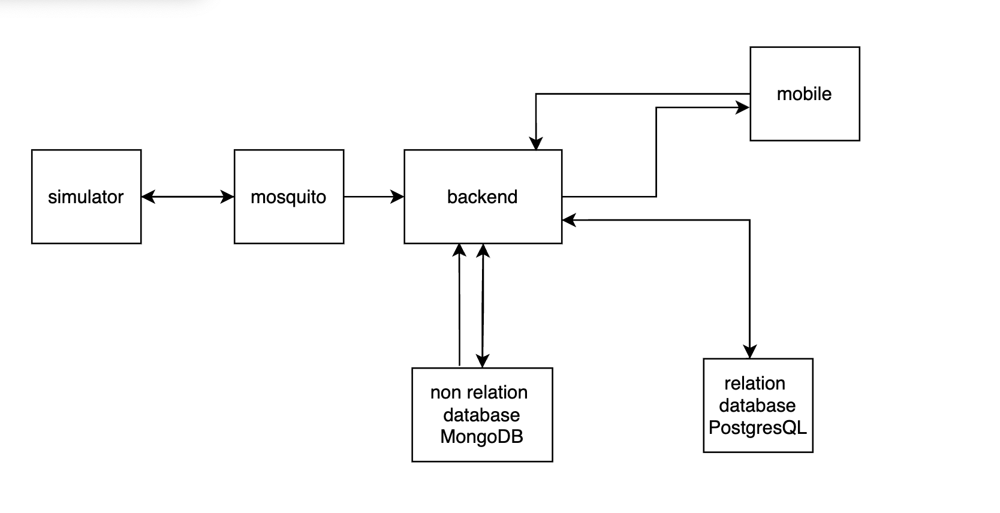

# Architecture J1 - Du capteur au téléphone

┌──────────────────────────┐
│ Capteurs simulés │
│ Simulator Kit (Python) │
└────────────┬─────────────┘
│ MQTT v1 : telemetry, state, availability
▼
┌──────────────────────────┐
│ Broker MQTT │
│ Mosquitto │
└────────────┬─────────────┘
│ MQTT / abonnement
▼
┌──────────────────────────┐
│ Backend │
│ Node.js + TypeScript │
│ Client MQTT (mqtt) │
└────────────┬─────────────┘
│ Requêtes SQL (driver pg)
▼
┌──────────────────────────┐
│ Stockage │
│ PostgreSQL │
│ mesures + capteurs │
└────────────▲─────────────┘
│ Lecture des mesures et de l'état
│
┌────────────┴─────────────┐
│ API REST │
│ Express.js │
│ http://localhost:3000 │
└────────────▲─────────────┘
│ HTTP / JSON
▼
┌──────────────────────────┐
│ Application mobile │
│ React Native │
└──────────────────────────┘

# Architecture J2 — Du capteur au téléphone

```
┌──────────────────────────┐
│   Capteurs simulés       │
│   Simulator Kit (Python) │
└────────────┬─────────────┘
             │  MQTT QoS 1 : telemetry, state, availability
             ▼
┌──────────────────────────┐
│   Broker MQTT            │
│   Mosquitto        │
└────────────┬─────────────┘
             │  abonnement MQTT
             ▼
┌──────────────────────────────────────────────────────┐
│   Backend — Node.js + TypeScript                     │
│                                                      │
│   Chemin d'écriture :                                │
│   1. Validation du message (parseTelemetry)          │
│   2. Déduplication par message_id dans MongoDB       │
│      (existsById → $setOnInsert + index unique)      │
│   3. Sauvegarde dans MongoDB (synced: false)         │
│   4. Sync par lots (≤ 500 msgs, toutes les 5 s)     │
│      MongoDB → PostgreSQL (ON CONFLICT DO NOTHING)   │
│                                                      │
│   Chemin de lecture :                                │
│   FallbackMeasurementRepository :                    │
│     → PostgreSQL (source de vérité)                  │
│     → MongoDB si PostgreSQL indisponible             │
└──────┬────────────────────────────┬──────────────────┘
       │ driver pg                  │ driver mongodb
       ▼                            ▼
┌─────────────────┐      ┌──────────────────────────┐
│   PostgreSQL 16 │      │   MongoDB 7              │
│   port 5432     │      │   port 27017             │
│   tables :      │      │   collection :           │
│   measurements  │      │   measurements           │
│   devices       │      │   (champ synced: bool)   │
│   données       │      │   tous les messages bruts│
│   vérifiées     │      │   reçus                  │
└────────┬────────┘      └──────────────────────────┘
         │  lecture via FallbackMeasurementRepository
         ▼
┌──────────────────────────┐
│   API REST               │
│   Express.js             │
│   port 3000              │
└────────────▲─────────────┘
             │  HTTP / JSON
             ▼
┌──────────────────────────┐
│   Application mobile     │
│   React Native (Expo)    │
│   TanStack Query v5      │
│   Cache persistant :     │
│   AsyncStorage (24 h)    │
│   Mode hors ligne :      │
│  networkMode offlineFirst│
└──────────────────────────┘
```

## Règles de flux

- **Écriture** : MongoDB reçoit tous les messages en premier. La déduplication y est garantie par un index unique sur `message_id` et l'opération `$setOnInsert`. PostgreSQL ne reçoit les données que via le batch de synchronisation.
- **Lecture** : l'API lit PostgreSQL. Si PostgreSQL est indisponible, `FallbackMeasurementRepository` bascule automatiquement sur MongoDB.
- **Cache mobile** : TanStack Query conserve les données en mémoire (24 h de `gcTime`) et les persiste sur disque via `@tanstack/react-query-persist-client` + `AsyncStorage`. En cas d'échec réseau, les données mises en cache restent affichées avec un bandeau « Mode hors ligne ».

Schéma de notre nouvelle architecture


# Architecture J3 — Sécuriser et fiabiliser le système IoT

```
┌──────────────────────────┐
│   Capteurs simulés       │
│   Simulator Kit (Python) │
│   devices.json           │
│   client_id = device_id  │
└────────────┬─────────────┘
             │  MQTT QoS 1 : telemetry (non-retained)
             │              state, availability (retained)
             │  topic : campus/v1/devices/{deviceId}/{type}
             ▼
┌──────────────────────────┐
│   Broker MQTT            │
│   Mosquitto              │
│   ACL par device         │
│   (générées depuis       │
│    devices.json via      │
│    mosquitto/start.sh)   │
└────────────┬─────────────┘
             │  abonnement MQTT (QoS 1, clean=false,
             │  clientId='backend-primary')
             ▼
┌──────────────────────────────────────────────────────────────────┐
│   Backend — Node.js + TypeScript                                 │
│                                                                  │
│   Réception (handleMessage — immédiat) :                         │
│   → saveRaw() : payload brut → raw_events (MongoDB, status=pending)│
│     sans aucune validation                                       │
│                                                                  │
│   Traitement par lot (processRawBatch — toutes les 5 s) :        │
│   1. Parsing JSON  → échec : log raw.parse_error,                │
│                       markRejected(raw_events)                   │
│                       + saveRejection → rejected_events (PG)     │
│   2. Validation Zod (message_id, device_id, room_id,             │
│      observed_at, temperature.value, co2.value)                  │
│   3. Plausibilité physique (T°: -50..100°C, CO₂: 0..5000 ppm)   │
│      → échec : log raw.rejected {reason},                        │
│                markRejected(raw_events)                          │
│                + saveRejection → rejected_events (PG)            │
│   4. Déduplication existsById → measurements (MongoDB)           │
│      → doublon : log raw.duplicate,                              │
│                  markDuplicate(raw_events)                       │
│                  + saveDuplicate → duplicate_events (PG)         │
│   5. save → measurements (MongoDB, $setOnInsert, synced=false)   │
│      + updateTelemetrySeen → devices.last_telemetry_at (PG)      │
│      + markAccepted(raw_events)  + log raw.accepted              │
│                                                                  │
│   Synchronisation (syncBatch — toutes les 5 s) :                 │
│   measurements (MongoDB, synced=false) → measurements (PG)       │
│   ON CONFLICT DO NOTHING (≤ 500 msgs) + markSyncedBatch          │
│                                                                  │
│   Chemin de lecture (API) :                                      │
│   FallbackMeasurementRepository :                                │
│     → PostgreSQL (ORDER BY observed_at DESC — état courant)      │
│     → MongoDB si PostgreSQL indisponible                         │
│                                                                  │
│   Fraîcheur :                                                    │
│   isStale = (now − devices.last_telemetry_at) > THRESHOLD        │
│   isOnline mis à jour uniquement par les messages availability   │
└──────┬─────────────────────────────┬────────────────┬────────────┘
       │ driver pg                   │ driver mongodb  │ stdout (NDJSON)
       ▼                             ▼                 ▼
┌──────────────────────┐   ┌──────────────────────┐ ┌────────────┐
│   PostgreSQL 16      │   │   MongoDB 7          │ │  Promtail  │
│   port 5432          │   │   port 27017         │ │ docker.sock│
│   tables :           │   │   collections :      │ └─────┬──────┘
│   measurements       │   │   raw_events         │       │ push
│   devices            │   │   (payloads bruts,   │       ▼
│   (last_telemetry_at)│   │    status: pending / │ ┌────────────┐
│   rejected_events    │   │    accepted /        │ │  Loki 2.9  │
│   duplicate_events   │   │    rejected /        │ │  port 3100 │
│   (preuve métier :   │   │    duplicate)        │ └─────┬──────┘
│   0 doublon dans     │   │   measurements       │       │ LogQL
│   measurements)      │   │   (validés,          │       ▼
└──────────┬───────────┘   │    synced: bool)     │ ┌────────────┐
           │               └──────────────────────┘ │  Grafana   │
           │lecture via FallbackMeasurementRepository│ port 3001 │
           ▼                                        └────────────┘
┌──────────────────────────┐
│   API REST               │
│   Express.js             │
│   port 3000              │
└────────────▲─────────────┘
             │  HTTP / JSON
             ▼
┌──────────────────────────┐
│   Application mobile     │
│   React Native (Expo)    │
│   TanStack Query v5      │
│   Cache persistant :     │
│   AsyncStorage (24 h)    │
│   Mode hors ligne :      │
│  networkMode offlineFirst│
└──────────────────────────┘
```

## Règles de flux J3

- **Réception immédiate** : tout payload telemetry est stocké dans `raw_events` (MongoDB, `status=pending`) sans aucune validation dès sa réception MQTT. Aucun message n'est perdu avant traitement.
- **Validation différée** : `processRawBatch` traite les `raw_events` en lots toutes les 5 s — parsing JSON, validation Zod, plausibilité physique. Chaque rejet est marqué `markRejected` dans `raw_events`, loggué (`raw.rejected` avec `reason`) et inséré dans `rejected_events` (PostgreSQL). Aucun message invalide n'atteint `measurements`.
- **Déduplication** : `existsById` sur `measurements` (MongoDB) avant toute écriture. Les doublons sont loggués (`raw.duplicate`), marqués `markDuplicate` dans `raw_events`, et insérés dans `duplicate_events` (PostgreSQL). La barrière `ON CONFLICT DO NOTHING` protège aussi la synchronisation vers PostgreSQL.
- **Identité** : `deviceId` extrait du topic avant toute lecture du payload. `devices.json` est la source de vérité ; ACL Mosquitto et backend en dérivent au démarrage.
- **ACL Mosquitto** : une règle par device générée depuis `devices.json` par `mosquitto/start.sh`, remplaçant le wildcard `+`.
- **Session MQTT persistante** : `clean=false` + `clientId='backend-primary'` — le broker conserve les messages publiés pendant une coupure du backend (jusqu'à `max_queued_messages`).
- **Ordre temporel** : l'état courant est sélectionné à la lecture par `ORDER BY observed_at DESC`. Les mesures retardées sont archivées sans écraser une mesure plus récente.
- **Fraîcheur** : `isStale` calculé à la requête (`now − last_telemetry_at > FRESHNESS_THRESHOLD_MS`, défaut 10 s). `isOnline` indépendant, mis à jour uniquement sur message `availability`.
- **Observabilité** : Promtail collecte le stdout JSON de tous les conteneurs via Docker socket et pousse dans Loki. Grafana interroge Loki en LogQL sans modification du code applicatif ni migration de schéma.
