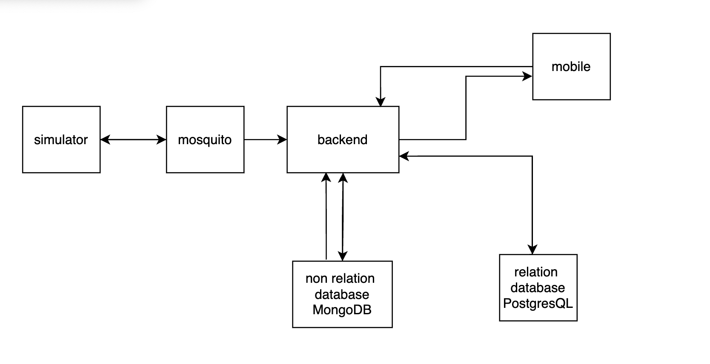

# Architecture J1 - Du capteur au téléphone

┌──────────────────────────┐
│ Capteurs simulés │
│ Simulator Kit (Python) │
└────────────┬─────────────┘
│ MQTT v1 : telemetry, state, availability
▼
┌──────────────────────────┐
│ Broker MQTT │
│ Mosquitto │
└────────────┬─────────────┘
│ MQTT / abonnement
▼
┌──────────────────────────┐
│ Backend │
│ Node.js + TypeScript │
│ Client MQTT (mqtt) │
└────────────┬─────────────┘
│ Requêtes SQL (driver pg)
▼
┌──────────────────────────┐
│ Stockage │
│ PostgreSQL │
│ mesures + capteurs │
└────────────▲─────────────┘
│ Lecture des mesures et de l'état
│
┌────────────┴─────────────┐
│ API REST │
│ Express.js │
│ http://localhost:3000 │
└────────────▲─────────────┘
│ HTTP / JSON
▼
┌──────────────────────────┐
│ Application mobile │
│ React Native │
└──────────────────────────┘

# Architecture J2 — Du capteur au téléphone

```
┌──────────────────────────┐
│   Capteurs simulés       │
│   Simulator Kit (Python) │
└────────────┬─────────────┘
             │  MQTT QoS 1 : telemetry, state, availability
             ▼
┌──────────────────────────┐
│   Broker MQTT            │
│   Mosquitto        │
└────────────┬─────────────┘
             │  abonnement MQTT
             ▼
┌──────────────────────────────────────────────────────┐
│   Backend — Node.js + TypeScript                     │
│                                                      │
│   Chemin d'écriture :                                │
│   1. Validation du message (parseTelemetry)          │
│   2. Déduplication par message_id dans MongoDB       │
│      (existsById → $setOnInsert + index unique)      │
│   3. Sauvegarde dans MongoDB (synced: false)         │
│   4. Sync par lots (≤ 500 msgs, toutes les 5 s)     │
│      MongoDB → PostgreSQL (ON CONFLICT DO NOTHING)   │
│                                                      │
│   Chemin de lecture :                                │
│   FallbackMeasurementRepository :                    │
│     → PostgreSQL (source de vérité)                  │
│     → MongoDB si PostgreSQL indisponible             │
└──────┬────────────────────────────┬──────────────────┘
       │ driver pg                  │ driver mongodb
       ▼                            ▼
┌─────────────────┐      ┌──────────────────────────┐
│   PostgreSQL 16 │      │   MongoDB 7              │
│   port 5432     │      │   port 27017             │
│   tables :      │      │   collection :           │
│   measurements  │      │   measurements           │
│   devices       │      │   (champ synced: bool)   │
│   données       │      │   tous les messages bruts│
│   vérifiées     │      │   reçus                  │
└────────┬────────┘      └──────────────────────────┘
         │  lecture via FallbackMeasurementRepository
         ▼
┌──────────────────────────┐
│   API REST               │
│   Express.js             │
│   port 3000              │
└────────────▲─────────────┘
             │  HTTP / JSON
             ▼
┌──────────────────────────┐
│   Application mobile     │
│   React Native (Expo)    │
│   TanStack Query v5      │
│   Cache persistant :     │
│   AsyncStorage (24 h)    │
│   Mode hors ligne :      │
│  networkMode offlineFirst│
└──────────────────────────┘
```

## Règles de flux

- **Écriture** : MongoDB reçoit tous les messages en premier. La déduplication y est garantie par un index unique sur `message_id` et l'opération `$setOnInsert`. PostgreSQL ne reçoit les données que via le batch de synchronisation.
- **Lecture** : l'API lit PostgreSQL. Si PostgreSQL est indisponible, `FallbackMeasurementRepository` bascule automatiquement sur MongoDB.
- **Cache mobile** : TanStack Query conserve les données en mémoire (24 h de `gcTime`) et les persiste sur disque via `@tanstack/react-query-persist-client` + `AsyncStorage`. En cas d'échec réseau, les données mises en cache restent affichées avec un bandeau « Mode hors ligne ».

Schéma de notre nouvelle architecture


# Architecture J3 — Sécuriser et fiabiliser le système IoT

```
┌──────────────────────────┐
│   Capteurs simulés       │
│   Simulator Kit (Python) │
│   devices.json           │
│   client_id = device_id  │
└────────────┬─────────────┘
             │  MQTT QoS 1 : telemetry (non-retained)
             │              state, availability (retained)
             │  topic : campus/v1/devices/{deviceId}/{type}
             ▼
┌──────────────────────────┐
│   Broker MQTT            │
│   Mosquitto              │
│   ACL par device         │
│   (générées depuis       │
│    devices.json via      │
│    mosquitto/start.sh)   │
└────────────┬─────────────┘
             │  abonnement MQTT (QoS 1, clean=false,
             │  clientId='backend-primary')
             ▼
┌──────────────────────────────────────────────────────────────────┐
│   Backend — Node.js + TypeScript                                 │
│                                                                  │
│   Réception (handleMessage — immédiat) :                         │
│   → saveRaw() : payload brut → raw_events (MongoDB, status=pending)│
│     sans aucune validation                                       │
│                                                                  │
│   Traitement par lot (processRawBatch — toutes les 5 s) :        │
│   1. Parsing JSON  → échec : log raw.parse_error,                │
│                       markRejected(raw_events)                   │
│                       + saveRejection → rejected_events (PG)     │
│   2. Validation Zod (message_id, device_id, room_id,             │
│      observed_at, temperature.value, co2.value)                  │
│   3. Plausibilité physique (T°: -50..100°C, CO₂: 0..5000 ppm)   │
│      → échec : log raw.rejected {reason},                        │
│                markRejected(raw_events)                          │
│                + saveRejection → rejected_events (PG)            │
│   4. Déduplication existsById → measurements (MongoDB)           │
│      → doublon : log raw.duplicate,                              │
│                  markDuplicate(raw_events)                       │
│                  + saveDuplicate → duplicate_events (PG)         │
│   5. save → measurements (MongoDB, $setOnInsert, synced=false)   │
│      + updateTelemetrySeen → devices.last_telemetry_at (PG)      │
│      + markAccepted(raw_events)  + log raw.accepted              │
│                                                                  │
│   Synchronisation (syncBatch — toutes les 5 s) :                 │
│   measurements (MongoDB, synced=false) → measurements (PG)       │
│   ON CONFLICT DO NOTHING (≤ 500 msgs) + markSyncedBatch          │
│                                                                  │
│   Chemin de lecture (API) :                                      │
│   FallbackMeasurementRepository :                                │
│     → PostgreSQL (ORDER BY observed_at DESC — état courant)      │
│     → MongoDB si PostgreSQL indisponible                         │
│                                                                  │
│   Fraîcheur :                                                    │
│   isStale = (now − devices.last_telemetry_at) > THRESHOLD        │
│   isOnline mis à jour uniquement par les messages availability   │
└──────┬─────────────────────────────┬────────────────┬────────────┘
       │ driver pg                   │ driver mongodb  │ stdout (NDJSON)
       ▼                             ▼                 ▼
┌──────────────────────┐   ┌──────────────────────┐ ┌────────────┐
│   PostgreSQL 16      │   │   MongoDB 7          │ │  Promtail  │
│   port 5432          │   │   port 27017         │ │ docker.sock│
│   tables :           │   │   collections :      │ └─────┬──────┘
│   measurements       │   │   raw_events         │       │ push
│   devices            │   │   (payloads bruts,   │       ▼
│   (last_telemetry_at)│   │    status: pending / │ ┌────────────┐
│   rejected_events    │   │    accepted /        │ │  Loki 2.9  │
│   duplicate_events   │   │    rejected /        │ │  port 3100 │
│   (preuve métier :   │   │    duplicate)        │ └─────┬──────┘
│   0 doublon dans     │   │   measurements       │       │ LogQL
│   measurements)      │   │   (validés,          │       ▼
└──────────┬───────────┘   │    synced: bool)     │ ┌────────────┐
           │               └──────────────────────┘ │  Grafana   │
           │lecture via FallbackMeasurementRepository│  port 3001 │
           ▼                                        └────────────┘
┌──────────────────────────┐
│   API REST               │
│   Express.js             │
│   port 3000              │
└────────────▲─────────────┘
             │  HTTP / JSON
             ▼
┌──────────────────────────┐
│   Application mobile     │
│   React Native (Expo)    │
│   TanStack Query v5      │
│   Cache persistant :     │
│   AsyncStorage (24 h)    │
│   Mode hors ligne :      │
│  networkMode offlineFirst│
└──────────────────────────┘
```

## Règles de flux J3

- **Deux zones MongoDB distinctes** :
  - `raw_events` est la zone **brute** : le payload MQTT original (chaîne brute, non parsée) y est inséré immédiatement à la réception, avant toute validation. Tout message, valide ou non, y est conservé. C'est la seule source permettant de retrouver le payload MQTT exact.
  - `measurements` est la zone **validée intermédiaire** : elle ne contient que des mesures ayant passé les trois couches de validation. Les champs y sont typés (scalaires), les objets imbriqués aplatis (`temperature.value` → `temperature`), et les champs inconnus du schéma Zod supprimés (mode strip). `received_at` reflète l'heure de traitement batch (≤ 5 s après la réception MQTT réelle, qui est dans `raw_events.received_at`).
- **Réception immédiate** : tout payload telemetry est stocké dans `raw_events` (MongoDB, `status=pending`) sans aucune validation dès sa réception MQTT. Aucun message n'est perdu avant traitement.
- **Validation différée** : `processRawBatch` traite les `raw_events` en lots toutes les 5 s — parsing JSON, validation Zod, plausibilité physique. Chaque rejet est marqué `markRejected` dans `raw_events`, loggué (`raw.rejected` avec `reason`) et inséré dans `rejected_events` (PostgreSQL). Aucun message invalide n'atteint `measurements`.
- **Déduplication** : `existsById` sur `measurements` (MongoDB) avant toute écriture. Les doublons sont loggués (`raw.duplicate`), marqués `markDuplicate` dans `raw_events`, et insérés dans `duplicate_events` (PostgreSQL). La barrière `ON CONFLICT DO NOTHING` protège aussi la synchronisation vers PostgreSQL.
- **Identité** : `deviceId` extrait du topic avant toute lecture du payload. `devices.json` est la source de vérité ; ACL Mosquitto et backend en dérivent au démarrage.
- **ACL Mosquitto** : une règle par device générée depuis `devices.json` par `mosquitto/start.sh`, remplaçant le wildcard `+`.
- **Session MQTT persistante** : `clean=false` + `clientId='backend-primary'` — le broker conserve les messages publiés pendant une coupure du backend (jusqu'à `max_queued_messages`).
- **Ordre temporel** : l'état courant est sélectionné à la lecture par `ORDER BY observed_at DESC`. Les mesures retardées sont archivées sans écraser une mesure plus récente.
- **Fraîcheur** : `isStale` calculé à la requête (`now − last_telemetry_at > FRESHNESS_THRESHOLD_MS`, défaut 10 s). `isOnline` indépendant, mis à jour uniquement sur message `availability`.
- **Observabilité** : Promtail collecte le stdout JSON de tous les conteneurs via Docker socket et pousse dans Loki. Grafana interroge Loki en LogQL sans modification du code applicatif ni migration de schéma.

# Architecture J4 — Files d'attente, workers et commandes

```
┌──────────────────────────┐
│   Capteurs simulés       │
│   Simulator Kit (Python) │
│   devices.json           │
│   client_id = device_id  │
└────────────┬─────────────┘
             │  MQTT QoS 1 : telemetry (non-retained)
             │              state, availability (retained)
             │              results (ACK de commandes)
             │  topic : campus/v1/devices/{deviceId}/{type}
             ▲  topic : campus/v1/devices/{deviceId}/commands
             │           (backend → device)
┌────────────┴─────────────┐
│   Broker MQTT            │
│   Mosquitto              │
│   ACL par device         │
└────────────┬─────────────┘
             │  abonnement MQTT (QoS 1, clean=false,
             │  clientId='backend-primary')
             ▼
┌──────────────────────────────────────────────────────────────────┐
│   Backend — Node.js + TypeScript                                 │
│                                                                  │
│   Réception (handleMessage — immédiat) :                         │
│   → topic telemetry  : ingestQueue.add({topic, payload})         │
│     retourne en < 1 ms — MongoDB n'est plus sur le chemin critique│
│   → topic availability : processAvailability() → devices (PG)   │
│   → topic state      : processState() → devices.ventilation (PG) │
│   → topic results    : commandService.handleAck() → commands (PG)│
│                                                                  │
│   Flux descendant (commande) :                                   │
│   POST /api/rooms/{id}/commands                                  │
│   → commandService.sendCommand()                                 │
│     1. Crée la commande en PostgreSQL (PENDING)                  │
│     2. Publie sur campus/v1/devices/{id}/commands (SENT)         │
│        { schema_version, command_id, action, enabled, expires_at}│
│   → timeout checker toutes les 10 s                              │
│     PENDING ou SENT + expires_at dépassé → TIMEOUT               │
│                                                                  │
│   Flux montant (ACK) :                                           │
│   handleAck() cherche la commande par command_id                 │
│   → status "executed"  → ACKNOWLEDGED                           │
│   → status "rejected"  → FAILED                                 │
│   → commande déjà TIMEOUT → log command.ack_after_timeout        │
│   → ACK déjà traité    → log command.ack_duplicate               │
│                                                                  │
│   Chemin de lecture (API) :                                      │
│   FallbackMeasurementRepository :                                │
│     → PostgreSQL (ORDER BY observed_at DESC — état courant)      │
│     → MongoDB si PostgreSQL indisponible                         │
│                                                                  │
│   Fraîcheur :                                                    │
│   isStale = (now − devices.last_telemetry_at) > THRESHOLD        │
└──────────────────┬───────────────────────────────────────────────┘
                   │  ingestQueue.add()
                   ▼
┌──────────────────────────┐
│   Redis 7                │
│   queue "ingest"         │
│   queue "sync"           │
│   (BullMQ)               │
│   tampon entre MQTT      │
│   et MongoDB             │
└───────┬──────────────────┘
        │                          │
        ▼                          ▼
┌──────────────────┐    ┌──────────────────────────────────────────┐
│  ingestWorker    │    │  syncWorker (concurrency=1)               │
│  (concurrency=5) │    │  findUnsynced(500) → measurements (PG)   │
│                  │    │  ON CONFLICT DO NOTHING + markSyncedBatch │
│  ingestOne() :   │    └──────────────────┬───────────────────────┘
│  1. saveRaw()    │                       │ driver pg
│     → raw_events │                       ▼
│     (MongoDB)    │    ┌──────────────────────────┐
│  2. JSON.parse() │    │   PostgreSQL 16           │
│  3. Zod valid.   │    │   measurements            │
│  4. plausibilité │    │   devices                 │
│  5. existsById() │    │   (last_telemetry_at,     │
│  6. save()       │    │    ventilation)           │
│     → measurements    │   rejected_events         │
│     (MongoDB)    │    │   duplicate_events        │
│  7. → syncQueue  │    │   commands                │
│                  │    │   (command_id, device_id, │
└────────┬─────────┘    │    action, params,        │
         │ driver mongodb    status, created_at,    │
         ▼             │    sent_at, acked_at,      │
┌──────────────────────┐    expires_at, ack_payload)│
│   MongoDB 7          │    └──────────────────────────┘
│   raw_events         │
│   (payloads bruts,   │    ┌────────────┐
│    status: pending / │    │  Promtail  │
│    accepted /        │    │ docker.sock│
│    rejected /        │    └─────┬──────┘
│    duplicate)        │          │ push
│   measurements       │          ▼
│   (validés,          │    ┌────────────┐
│    synced: bool)     │    │  Loki 2.9  │
└──────────────────────┘    │  port 3100 │
                            └─────┬──────┘
                                  │ LogQL
                                  ▼
                            ┌────────────┐
                            │  Grafana   │
                            │  port 3001 │
                            └────────────┘
┌──────────────────────────┐
│   API REST               │
│   Express.js / port 3000 │
│   GET  /api/rooms         │
│   GET  /api/rooms/{id}    │
│   GET  /api/rooms/{id}/history                │
│   POST /api/rooms/{id}/commands               │
│   GET  /api/rooms/{id}/commands               │
│   GET  /api/commands/{commandId}              │
└────────────▲─────────────┘
             │  HTTP / JSON
             ▼
┌──────────────────────────┐
│   Application mobile     │
│   React Native (Expo)    │
│   TanStack Query v5      │
│   Cache persistant :     │
│   AsyncStorage (24 h)    │
│   Mode hors ligne :      │
│  networkMode offlineFirst│
│   Commandes ventilation  │
│   poll statut toutes 2 s │
└──────────────────────────┘
```

## Topics MQTT J4

| Topic | Direction | Contenu |
|---|---|---|
| `campus/v1/devices/{id}/telemetry`  | Device → Backend | Mesure : `message_id`, `temperature`, `co2` |
| `campus/v1/devices/{id}/state`      | Device → Backend | État courant : `ventilation`, `boot_id` (retained) |
| `campus/v1/devices/{id}/availability` | Device → Backend | `status: online\|offline` (retained) |
| `campus/v1/devices/{id}/commands`   | Backend → Device | Commande : `command_id`, `action`, `enabled`, `expires_at` |
| `campus/v1/devices/{id}/results`    | Device → Backend | ACK : `command_id`, `status: executed\|rejected` |

## Règles de flux J4

- **Réception non bloquante :** `handleMessage` appelle `ingestQueue.add()` qui retourne en moins d'une milliseconde. La réception MQTT n'est plus bloquée par MongoDB.
- **ingestWorker (concurrency=5) :** pour chaque job : sauvegarde brute dans `raw_events`, parsing JSON, validation Zod, plausibilité physique, déduplication par `existsById`, sauvegarde dans `measurements` (MongoDB, `synced=false`), déclenchement du syncWorker.
- **syncWorker (concurrency=1) :** un seul worker actif pour éviter les insertions PostgreSQL concurrentes. Lit `findUnsynced(500)`, insère en batch (`ON CONFLICT DO NOTHING`), marque `synced=true` dans MongoDB.
- **Corrélation commande/ACK :** le `commandId` (UUID v4) est inclus dans la commande MQTT et recopié dans l'ACK par le device. C'est le seul lien entre les deux. Si le `commandId` est inconnu du backend, l'ACK est ignoré.
- **Cycle de vie commande :** `PENDING → SENT → ACKNOWLEDGED` ou `FAILED`. Sans ACK dans le délai (`expires_at = now + 30 s`), le backend passe la commande en `TIMEOUT` (checker toutes les 10 s).
- **ACK tardif :** si l'ACK arrive après le `TIMEOUT`, le statut reste `TIMEOUT`. Le backend logge `command.ack_after_timeout` pour garder une trace sans modifier l'état.
- **Idempotence :** le simulateur ne ré-exécute jamais une action pour un `commandId` déjà traité. Le backend ignore les ACK dupliqués (`command.ack_duplicate`).
- **État ventilation :** le backend s'abonne à `campus/v1/devices/+/state` et met à jour `devices.ventilation` à chaque publication de l'objet.
